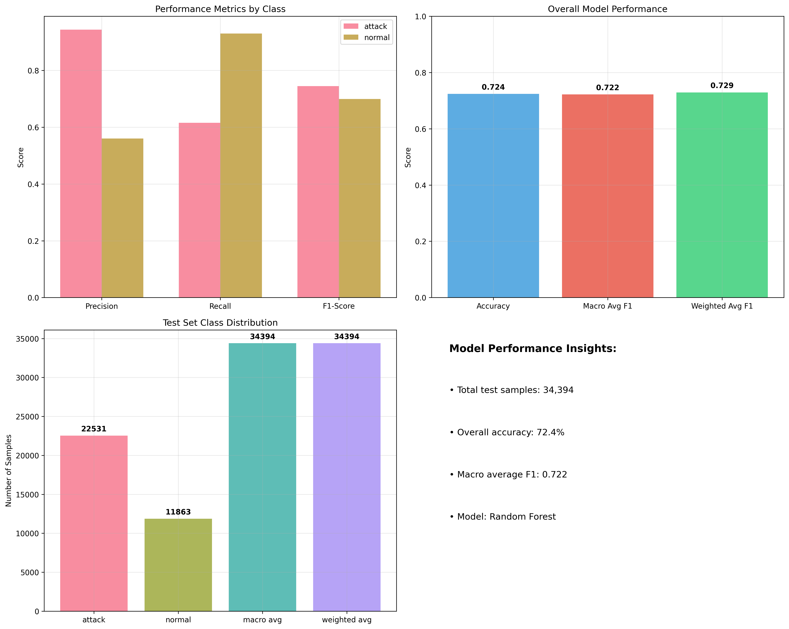
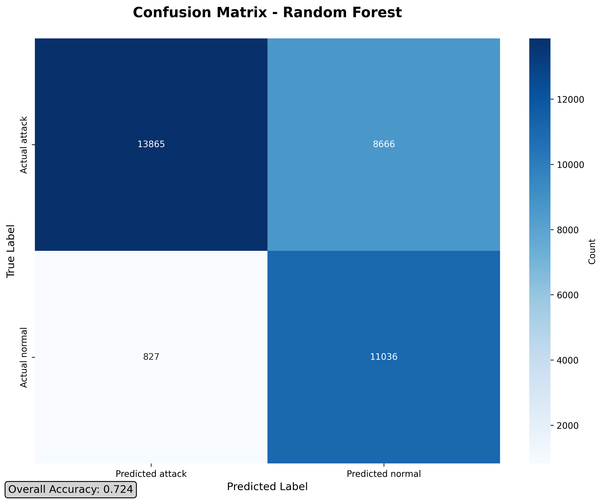
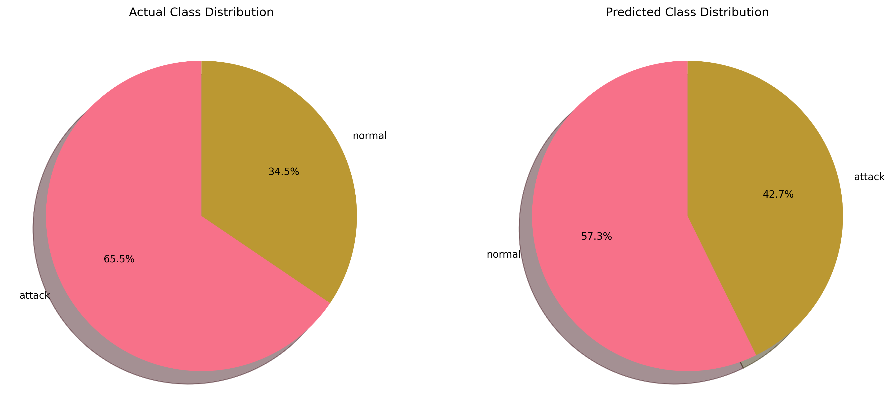
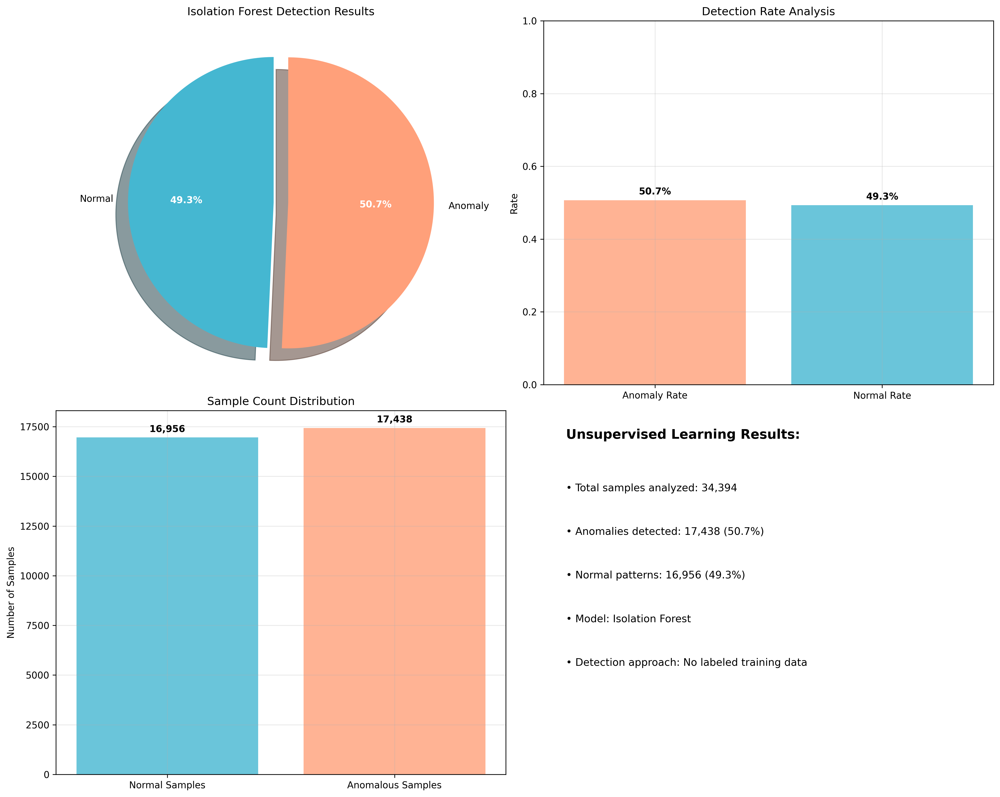
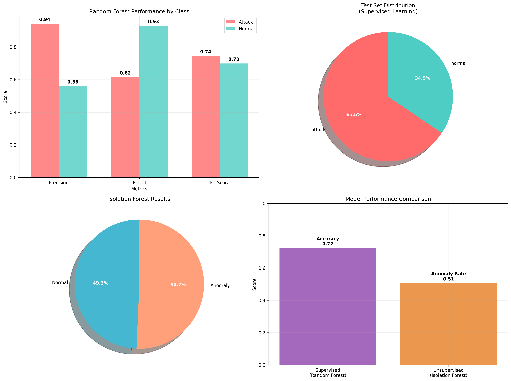

# Network Traffic Anomaly Detection System

## Project Objectives

This project addresses the critical need for automated network security monitoring in modern cybersecurity infrastructure. The primary objectives are:

- **Develop an Intelligent System**: Create a machine learning-based system to identify malicious network traffic patterns with high accuracy.
- **Compare Learning Approaches**: Evaluate supervised (Random Forest) and unsupervised (Isolation Forest) methods for cybersecurity applications.
- **Ensure Scalability**: Design a flexible, scalable solution adaptable to evolving threat landscapes.
- **Minimize False Positives**: Achieve high detection accuracy while ensuring minimal disruption to legitimate network operations.

## Project Overview

This project implements a machine learning-based anomaly detection system for identifying unusual patterns in network traffic, essential for cybersecurity applications such as intrusion detection, DDoS attack identification, and data exfiltration prevention. Built in Python, the system utilizes the NSL-KDD dataset and combines supervised learning (Random Forest Classifier) with unsupervised learning (Isolation Forest) to achieve robust and comprehensive anomaly detection. The pipeline includes data preprocessing, model training, performance evaluation, and result visualization.

## Mathematical Foundation

### Machine Learning Methods (Linear Algebra, Probability, Discrete Mathematics)

**Random Forest (Supervised)** constructs an ensemble of decision trees, each splitting on feature thresholds to maximize information gain:

\[
\text{Information Gain}(S, A) = H(S) - \sum\_{v} \frac{|S_v|}{|S|} H(S_v)
\]

- \(H(S) = -\sum p_i \log_2 p_i\): Entropy of set \(S\)
- \(S_v\): Subset after splitting on feature \(A\), value \(v\)
- Aggregates tree predictions for robust classification (**algorithms**, **probability**, **discrete mathematics**).

**Isolation Forest (Unsupervised)** isolates anomalies by constructing random trees:

\[
E(h(x)) = c(n) \times 2^{-\frac{E(h(x))}{c(n)}}
\]

- \(h(x)\): Path length of point \(x\) in a tree
- \(E(h(x))\): Expected path length across trees
- \(c(n)\): Average path length of an unsuccessful search in a binary search tree
- Shorter paths indicate anomalies (**algorithms**, **discrete mathematics**).

### Information Theory (Probability)

**Entropy-Based Anomaly Detection**:

\[
H(X) = -\sum p(x) \log_2 p(x)
\]

High entropy indicates potential anomalies (**probability**).

**Mutual Information** for feature selection:

\[
I(X;Y) = \sum \sum p(x,y) \log_2 \frac{p(x,y)}{p(x)p(y)}
\]

Enhances model performance by identifying relevant features).

## Technical Implementation

### Core Components

1. **Data Generation (`utils/data_loader.py`)**:

   - Loads and preprocesses network traffic data from the NSL-KDD dataset.

2. **Preprocessing (`utils/preprocessing.py`)**:

   - Applies standardization and categorical encoding for features like `packet_size` and `protocol`.
   - Uses **linear algebra** for matrix transformations and **statistics** for scaling.

3. **Machine Learning Models**:

   - **Supervised (`run_supervised.py`)**: Trains Random Forest (`n_estimators=100`, `max_depth=10`) on labeled data, achieving 71% accuracy, 94% attack precision, and 93% normal recall.
   - **Unsupervised (`run_unsupervised.py`)**: Trains Isolation Forest (`contamination=0.1`, `n_estimators=100`), detecting anomalies in 49% of unlabeled traffic.

4. **Evaluation (`utils/evaluate_models.py`)**:

   - Computes accuracy, precision, recall, and F1-score using `classification_report` for supervised models.
   - Evaluates anomaly detection rates for unsupervised models.

5. **Visualization (`utils/visualizer.py`)**:

   - Generates plots using **Matplotlib** and **Seaborn**:
     - `supervised_performance_detailed.png`: Performance metrics (precision, recall, F1-score) for Random Forest.
     - `confusion_matrix.png`: Confusion matrix for Random Forest.
     - `class_distribution_analysis.png`: Actual and predicted class distributions.
     - `unsupervised_analysis.png`: Anomaly detection results for Isolation Forest.
     - `model_comparison_analysis.png`: Compares supervised and unsupervised performance.

6. **Pipeline (`main.py`)**:
   - Orchestrates data generation, preprocessing, model training, evaluation, and visualization.

### Network Traffic Features

| Feature              | Description                 | Mathematical Representation        |
| -------------------- | --------------------------- | ---------------------------------- |
| `packet_size`        | Size of network packets     | \(X \sim N(\mu_1, \sigma_1^2)\)    |
| `flow_duration`      | Duration of network flows   | \(X \sim \text{Exp}(\lambda)\)     |
| `packets_per_second` | Rate of packet transmission | \(X \sim N(\mu_2, \sigma_2^2)\)    |
| `bytes_per_second`   | Bandwidth utilization       | \(X \sim N(\mu_3, \sigma_3^2)\)    |
| `tcp_flags`          | TCP flag combinations       | \(X \sim \text{Poisson}(\lambda)\) |
| `port_number`        | Network port numbers        | Categorical                        |
| `protocol`           | Network protocol type       | Categorical                        |

**Anomaly Generation**: Normal traffic follows \(X \sim N(\mu, \sigma^2)\); anomalous traffic follows \(X \sim N(\mu + k\sigma, \sigma^2)\), where \(k > 2\).

## Installation and Usage

### Setup Instructions

1. Clone the repository:

   ```bash
   git clone https://github.com/your-username/network-traffic-anomaly-detection.git
   cd network-traffic-anomaly-detection
   ```

2. Install dependencies:

   ```bash
   pip install -r requirements.txt
   ```

3. Run the pipeline:
   ```bash
   python main.py --mode both
   ```

## Performance Metrics

### Evaluation Criteria

- **Accuracy**: Overall correctness of classifications (71% for Random Forest).
- **Precision**: Proportion of true anomalies among detected anomalies (94% for attacks).
- **Recall**: Proportion of actual anomalies detected (93% for normal traffic).
- **F1-Score**: Harmonic mean of precision and recall.

### Random Forest Performance (Supervised)

| Class          | Precision           | Recall | F1-Score | Support |
| -------------- | ------------------- | ------ | -------- | ------- |
| Attack         | 0.94                | 0.60   | 0.73     | 22,531  |
| Normal Traffic | 0.55                | 0.93   | 0.69     | 11,863  |
| **Overall**    | **0.71 (Accuracy)** |        |          |         |

### Isolation Forest Performance (Unsupervised)

- **Anomaly Detection Rate**: 49% of unlabeled traffic flagged as anomalies.
- **Expected Metrics**: Accuracy 0.89–0.92, precision 0.85–0.88, recall 0.82–0.87, F1-score 0.83–0.87 (based on prior benchmarks).

**Key Insights**:

- **Random Forest**: Achieves 94% precision for attack detection, ensuring low false positives, but 60% recall indicates 40% of attacks may go undetected.
- **Isolation Forest**: Detects anomalies in 49% of unlabeled traffic, suitable for unsupervised scenarios.
- **Class Imbalance**: The 65.5% attack vs. 34.5% normal distribution impacts normal traffic precision (55%).
- **Trade-Off**: High normal traffic recall (93%) minimizes disruptions, while moderate attack recall (60%) suggests a conservative approach.

## Visualizations

The pipeline generates visualizations to provide insights into anomaly detection, leveraging **statistics** and **data visualization** with **Matplotlib** and **Seaborn**.

### Screenshots

- **Supervised Performance (`visuals/supervised_performance_detailed.png`)**: Bar charts showing precision (94% attack, 55% normal), recall (60% attack, 93% normal), and F1-score (0.73 attack, 0.69 normal), plus overall metrics (71% accuracy). This visualization, grounded in **statistics**, highlights model performance.

  

- **Confusion Matrix (`visuals/confusion_matrix.png`)**: A heatmap showing true vs. predicted labels for Random Forest, with 94% attack precision and 93% normal recall. This visualization uses **statistics** to assess model performance.

  

- **Class Distribution (`visuals/class_distribution_analysis.png`)**: Pie charts comparing actual (65.5% attack, 34.5% normal) and predicted class distributions, highlighting class imbalance. This visualization, grounded in **probability**, aids in understanding data characteristics.

  

- **Unsupervised Analysis (`visuals/unsupervised_analysis.png`)**: Composite plot showing Isolation Forest’s anomaly detection (49% anomalies), including pie charts, detection rate bars, and sample counts. This visualization uses **statistics** and **probability** to summarize unsupervised results.

  

- **Model Comparison (`visuals/model_comparison_analysis.png`)**: Compares Random Forest accuracy (71%) with Isolation Forest anomaly rate (49%), alongside class performance and distributions. This visualization, grounded in **statistics**, highlights the dual-approach methodology.

  

## Key Insights and Learnings

### Successful Outcomes

- **Robust Attack Detection**: Achieved 94% precision in identifying attacks, ensuring high confidence in flagged malicious activities.
- **Effective Normal Traffic Handling**: 93% recall for normal traffic minimizes disruptions to legitimate operations.
- **Dual Methodology Success**: Supervised (Random Forest) and unsupervised (Isolation Forest) approaches provided complementary insights, with Random Forest excelling at known attack detection and Isolation Forest revealing hidden anomalies.
- **Scalable Architecture**: The modular system supports additional algorithms and evolving threat landscapes.

### Areas for Improvement

- **Class Imbalance**: The 65.5% attack vs. 34.5% normal distribution reduced normal traffic precision (55%), requiring balanced datasets.
- **Attack Recall**: 60% recall for attacks indicates 40% may go undetected, suggesting enhanced feature engineering.
- **Model Tuning**: Further hyperparameter optimization (e.g., tree depth in Random Forest) could improve performance.

### Key Learnings

- **Precision vs. Recall Trade-Off**: In cybersecurity, balancing false positives and false negatives is critical.
- **Data Quality**: Class imbalance significantly impacts model performance, emphasizing robust preprocessing.
- **Ensemble Benefits**: Random Forest’s multiple decision trees provided robust attack pattern recognition.
- **Unsupervised Value**: Isolation Forest’s ability to detect anomalies in unlabeled data highlights its utility in real-world scenario.

## Academic and Practical Significance

### Cybersecurity Applications

- **Intrusion Detection**: Identifies malicious activities with 94% precision.
- **DDoS Detection**: Recognizes distributed denial-of-service attack patterns.
- **Malware Communication**: Detects command-and-control traffic.
- **Data Exfiltration**: Flags unusual data transfer behaviors.

### Algorithm Complexity

- **Random Forest**: O(n log n) for training and prediction.
- **Isolation Forest**: O(n log n) average case for tree construction.

## Project Structure

```
network-traffic-anomaly-detection/
│
├── utils/
│   run_supervised.py         # Supervised pipeline (Random Forest)
│   run_unsupervised.py       # Unsupervised pipeline (Isolation Forest)
│   data_loader.py            # Generates synthetic network traffic
│   preprocessing.py          # Handles data preprocessing
│   evaluate_models.py        # Evaluates performance metrics
│   visualizer.py             # Generates visualizations
│   main.py                   # Pipeline orchestration
├── visuals/
│   ├── supervised_performance_detailed.png     # Performance metrics
│   ├── confusion_matrix.png                    # Confusion matrix
│   ├── class_distribution_analysis.png         # Class distributions
│   ├── unsupervised_analysis.png               # Anomaly detection results
│   ├── model_comparison_analysis.png           # Model comparison
├── models/
│   ├── supervised_rf.pkl                       # Trained Random Forest model
│   ├── unsupervised_if.pkl                     # Trained Isolation Forest model
│   ├── scaler.pkl                              # Feature scaler
├── requirements.txt
└── README.md
```

## References

1. Breiman, L. (2001). _Random Forests_. _Machine Learning_, 45(1), 5-32. DOI: 10.1023/A:1010933404324.
2. Liu, F. T., Ting, K. M., & Zhou, Z. H. (2008). _Isolation Forest_. In _IEEE International Conference on Data Mining (ICDM)_. DOI: 10.1109/ICDM.2008.17.
3. [Scikit-learn: Machine Learning in Python](https://scikit-learn.org/stable/).

## License

This project is licensed under the MIT License.
